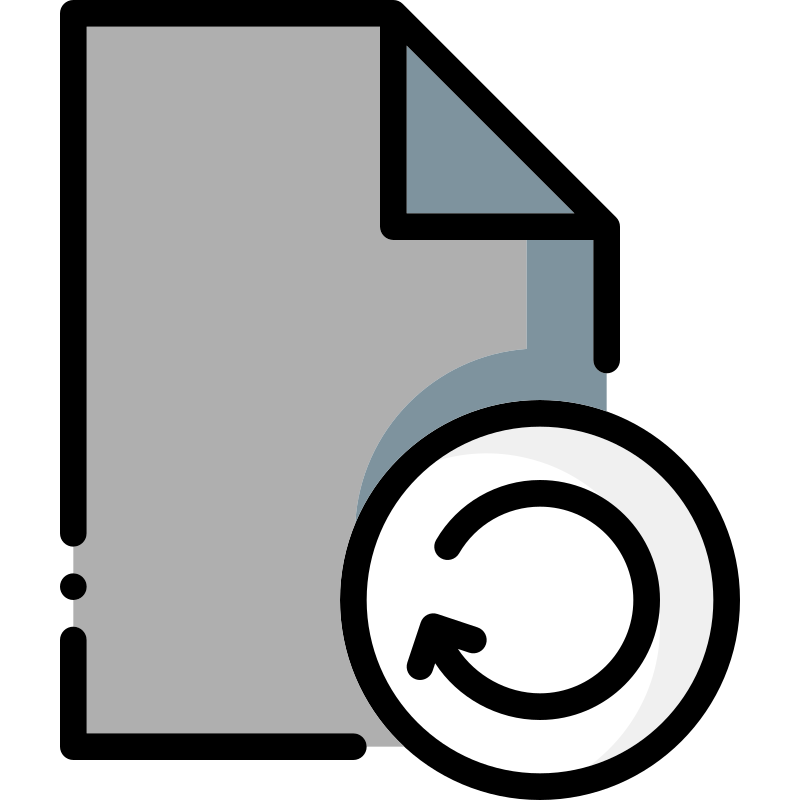

[](https://github.com/Daisie-Bell/svaeva-sdk/svaeva-sdk/pulls?utf8=%E2%9C%93&q=is%3Apr%20author%3Aapp%2Fdependabot)

[](https://github.com/PyCQA/bandit)
[](https://github.com/Daisie-Bell/svaeva-sdk/svaeva-sdk/blob/master/.pre-commit-config.yaml)
[](https://github.com/Daisie-Bell/svaeva-sdk/svaeva-sdk/releases)
[](https://github.com/Daisie-Bell/svaeva-sdk/svaeva-sdk/LICENSE)

# Documentation Svaeva SDK

## Index

| Topics | SubTopic | SubSubTopic |
| ----- | ----- | ----- |
| [ReadME](../README.md) |  |  |
| [Main_Documentation](#Documentation) |  |  |
|   | DataBase |  |
|   |  └──     | [Platforms](./DataBase/Platforms/README.md) |
|   |  └──     | [Groups](./DataBase/Groups/README.md) |
|   |  └──     | [Users](./DataBase/Users/README.md) |
|   |  └──     | [Actions](./DataBase/Actions/README.md) |
|   | MultiAPI |  |
|   |  └──     | [Data-Models](./MultiAPI/DataModels/README.md) |
|   |  └──     | [Virtual_Bounds](./MultiAPI/Virtual Bound/README.md) |
|   |  └──     | [Skeletons](./MultiAPI/Skeletons/README.md) |
|   |  └──     | [Configurations](./MultiAPI/Configurations/README.md) |
|   |  └──     | [Wallets](./MultiAPI/Wallets/README.md) |


## Documentation Client

| Section | Subsection | Questions |
| ------- | ---------- | ------- |
| [Installation](#Installation) |  |  |
| [Client](#Client) |  |  |
|    └──  | [Description](#Description) |  |
|    └──  | [Usage](#Usage) |  |
|         | └── | [How to start the client?](#How-to-start-the-client) |
|         | └── | [How to start the client with a local solution?](#How-to-start-the-client-with-a-local-solution) |
|    └──  | [License](#License) |  |
|    └──  | [Acknowledgments](#Acknowledgments) |  |
|    └──  | [Authors](#Authors) |  |

## Installation

```bash
poetry add git+https://github.com/Daisie-Bell/svaeva-sdk.git
```

## Client

### Description

The `Client` class is the main class of the svaeva SDK. It is responsible for managing svaeva API calls.

### Usage

#### How to start the client?

```python
from svaeva import Svaeva

client = Svaeva(URL_SvaevAPI,token)
```

#### How to start the client with a local solution?

```bash
Sveava_IP=<IP/DNS>
Svaeva_Key=<KEY>
```

```python
from svaeva import Svaeva

client = Svaeva()
```

<a href="#index" class="button">
    
</a>

## How-To - Use-cases

[Link to Usecase version 1.0]()

## License

This project is licensed under the MIT License - see the [LICENSE.md](LICENSE.md) file for details

## Acknowledgments

-   [Daisie Lab](https://daisie.com/)
-   [Svaeva](https://svaeva.com/)

## Authors 

[Coder/Manager]

<a href="https://github.com/Vortex5Root">
    <div style="display: flex; justify-content: center; align-items: center; height: 100px; width: 450px;">
        </img>
        <a href="https://github.com/Vortex5Root">Vortex5Root <br><b>        {Full-Stack Software Engineer - Daisie Lab - Svaeva}</b></a>
    </div>
</a>


[Colaborators]

<a href="https://github.com/elacosse">
    <div style="display: flex; justify-content: center; align-items: center; height: 100px; width: 400px;">
        
        <a href="https://github.com/elacosse">elacosse <br><b>{Researcher - Daisie Lab - Svaeva}</b> </a>
    </div>
</a>

