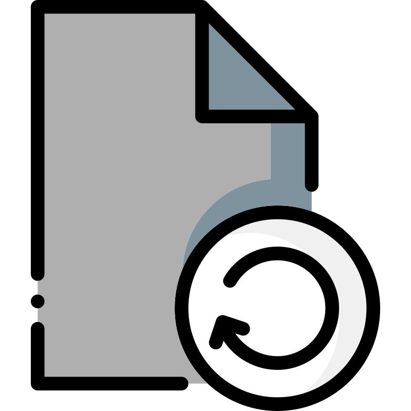

<a href="../../../../README.md#index" class="button">
    
</a>

# DataProgramming

| Problem Statement | Solution |
|-------------------|----------|
| The problem that Data Programming aims to solve is the lack of a standardized and efficient way to handle data in code. Data Programming provides a solution by offering a framework for building data circuits, which are responsible for managing the flow of data in an application. By using Data Programming, developers can easily handle and manipulate data in their code, leading to more organized and efficient data management. | Data Programming aims to solve the problem of the lack of a standardized and efficient way to handle data in code. It provides a framework for building data crickets, which are responsible for managing the flow of data in an application.By using Data Programming, developers can easily handle and manipulate data in their code, leading to more organized and efficient data management. The framework offers functions such as starting the connection with the Svaeva API, adding external API models to the data code, loading API keys and interacting with external APIs, retrieving configurations, loading data configurations from user groups, storing actions in the database, and normalizing input data. Overall, Data Programming provides a solution to the problem by offering a structured approach to handle data in code, making it easier for developers to manage and manipulate data efficiently. |

## Installation

[Click here](../../../../README.md#installation)

## Dependencies

[Click here](../../../../README.md#dependencies)

# Index
| Section                           | Subsection                             | Details                            |
|-----------------------------------|----------------------------------------|------------------------------------|
| [Index](#index)                   |                                        |                                    |
| [Documentation](#documentation)   |                                        |                                    |
|   - How to start using data models? | [Link](#how-to-start-using-data-models) |                                    |
|     - what is the DataModel?     | [Link](#what-is-the-datamodel)         |                                    |
|     - Structure                  | [Link](#structure)                    |                                    |
|       - Attributes               | [Link](#attributes)                   |                                    |
|       - Methods                 | [Link](#methods)                      |                                    |
|   - Pseudo Code                  | [Link](#pseudo-code)                  |                                    |
|     - Functions                  | [Link](#functions)                    |                                    |
|       - `start(token* : str)`    | [Link](#starttoken--str)             |                                    |
|       - `add_model(model_name* : str)` | [Link](#add_modelmodel_name--str)  |                                    |
|       - `self.load_wallet() -> None:` | [Link](#selfload_wallet---none)     |                                    |
|       - `get_config(name : str) -> dict:` | [Link](#get_configname--str---dict) |                                    |
|       - `load_dataconfig(data)`   | [Link](#load_dataconfigdata)         |                                    |
|       - `store(self,data,skeleton,config=None,user=False)` | [Link](#storeselfdataskeletonconfignoneuserfalse) |                            |
|       - `normalizer(self,data):`   | [Link](#normalizerselfdata)         |                                    |
|       - `forward(self,data):`      | [Link](#forwardselfdata)            |                                    |
|   - DataModel Examples           | [Link](#datamodel-examples)           |                                    |
|     - License                    | [Link](#license)                      |                                    |
|     - Acknowledgments            | [Link](#acknowledgments)              |                                    |
|     - Authors                    | [Link](#authors)                      |                                    |
|     - Conclusion                 | [Link](#conclusion)                   |                                    |

    
# Documentation

## How to start using data models?

```python
from svaeva.Paths.MultiAPI.Models import DataModel

class MyModel(DataModel):
    def __init__(self, token):
        super().__init__(token)

    def forward(self, data : Any) -> Any:
        """
        BUILD YOUR DATA FOLLOW.
        """
        return data
```

### what is the DataModel?

DataModel is a class that you can use to create your own data model. This class has all the functions that you need to start using the Svaeva API.

### Structure

#### Attributes

- `ai_models` (Dict): A dictionary to store AI models.
- `configs` (Dict): A dictionary to store configurations.
- `cash` (Dict): A dictionary to store cash.
- `logger` (logging.Logger): Logger object for logging debug messages.
- `token` (str): Token for authentication.
- `svaeva` (Svaeva): Svaeva object for interacting with the Svaeva API.
- `name` (str): Name of the data model.

#### Methods

- `start`: Initializes the data model with the provided token.
- `add_model`: Adds a new AI model to the data model.
- `load_wallet`: Loads the wallet for the data model.
- `load_config`: Loads a configuration for the data model.
- `load_dataconfig`: Loads data configuration for the data model.
- `store`: Stores data in the data model.
- `forward`: Forwards data to the next step in the data model pipeline.
- `normalizer`: Normalizes the incoming data.

## Pseudo Code

### Fuctions

#### `start(token* : str)`
This function is used to start the connection with Svaeva API. It is required to use the API.

##### Backend
```
This function will create:
- self.token (this is the token used to connect to the API)
- self.svaeva (this is the object used to connect to the API)
- self.name = self.__class__.__name__ (this is the name of the model)
```

#### `add_model(model_name* : str)`
- This function allows you to add external api models in to your data code.

##### Backend
```
- This function adds a key in to a dictionary named ai_models.
- ai_models will contain the VRest objects. (after load_wallet)
```

#### `self.load_wallet() -> None:`
- This function will load all your API keys and start the RestAPI Object to interact with the External APIs.

##### Backend

```
This function will call svaeva to get all your API keys for the external APIs;
This function will get all the Skeletons for call external APIs;
This function will update the ai_models dictionary with the VRest objects.
```

#### `get_config(name : str) -> dict:`

- This function calls svaeva api to get a configuration to use in your data code.

##### Backend
```
This function will call svaeva to get a config;
This function will update the configs dict with the config.
```

#### `load_dataconfig(data)`
- This function will load all your data configurations from the user group.

##### Backend
```
This function will call svaeva to check if is a valid user;
This function will get the group from the user;
This function will get all the data configs from the group;
This function will update the data_configs dict with the data configs.
```

#### `store(self,data,skeleton,config=None,user=False)`
- This function will store a action in the database.

##### Backend
```
first will check the direction with user variable; 
this function will build a Dict;
    - {
        "model_id": self.name,
        "skeleton_id": skeleton,
        "config_id": config,
        "user_id": data["sender"],
        "direction": direction,
        "content_data": data[data["type"]],
        "content_text": str(data[data["type"]]),
        "platform": data["platform"]
    }
this function will call svaeva to store the data.
```

#### `normalizer(self,data):`
this function is used to normalize the input data (WebSocket/Post).

##### Backend
```
this function will check if the data is from WebSocket or Post;
this function will normalize the data;
```

#### `forward(self,data):` 
* This Function is used to forward the data to the external APIs.
you need to build your own function to use this function.

## DataModel Exemples

[Click me to see same exemples](https://github.com/Daisie-Bell/DataModels)


## License

This project is licensed under the MIT License - see the [LICENSE.md](LICENSE.md) file for details

## Acknowledgments

-   [Daisie Lab](https://daisie.com/)
-   [Svaeva](https://svaeva.com/)

## Authors 

[Coder / Manager]
[Vortex5Root](https://github.com/Vortex5Root) - (Engineering Manager,Full-Stack Software Engineer - Daisie Lab - Svaeva)

[Colaborators]
[elacosse - (Researcher - Daisie Lab - Svaeva)]

## Conclusion

DataModel framework provides a solution to the problem of handling data in code by offering a structured approach and a set of functions for managing data flow. It aims to improve data management efficiency and organization in applications. Developers can easily integrate DataModel into their code and benefit from its features for handling and manipulating data.

This project is a work in progress. We are constantly adding new features and improving the existing ones. If you have any suggestions or feedback, please feel free to contact us at [send email](mailto:leonardo.leitao@research.fchampalimaud.org "send email"). We would love to hear from you!
